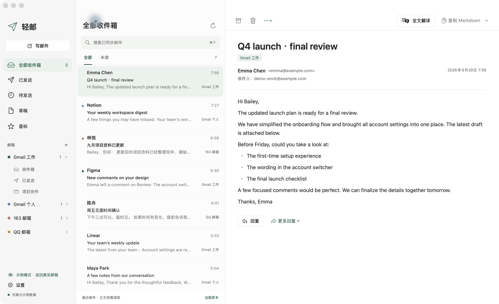
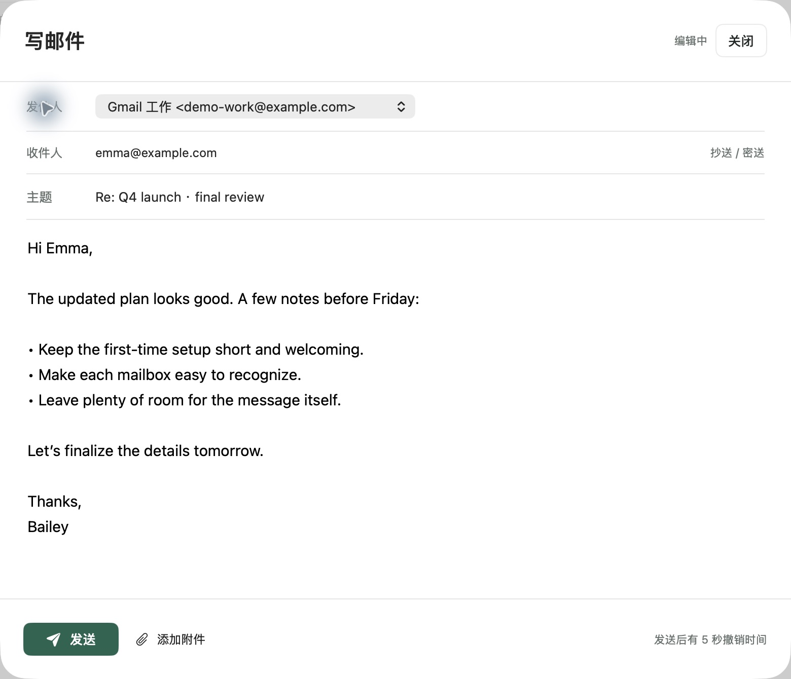

<div align="center">
  
  <h1>轻邮 · Lightmail</h1>
  <p><strong>多个邮箱，一处清爽。</strong></p>
  <p>为 Mac 打造的轻量本地邮箱客户端。聚合收发、专注阅读、全文翻译、一键 Markdown。</p>
  <p>A lightweight, native macOS email client. Multiple inboxes. One quiet workspace.</p>
  <p>
    <a href="https://github.com/baileyh8/lightmail/releases/tag/v0.0.1"></a>
    
    
    <a href="LICENSE"></a>
    <a href="https://github.com/baileyh8/lightmail/actions/workflows/ci.yml"></a>
  </p>
  <p><a href="https://lightmail.sohym.com">官网</a> · <a href="https://github.com/baileyh8/lightmail/releases/tag/v0.0.1">下载预览版</a> · <a href="docs/getting-started.md">使用指南</a> · <a href="https://github.com/baileyh8/lightmail/issues">反馈问题</a></p>
</div>



<p align="center"><sub>真实应用截图 · 内置演示模式 · 邮件与账号均为虚构数据</sub></p>

## 把空间留给邮件

工作邮箱、个人 Gmail、163、QQ，可以一起看，也可以分开看。轻邮用原生三栏界面呈现账号、邮件和正文；重要内容在眼前，工具在手边。

| | 轻邮可以做什么 |
|---|---|
| **多个邮箱，一起管理** | 聚合收件箱与已发送，按账号、文件夹、未读和星标查看；Gmail 标签副本去重。 |
| **保留邮件原貌** | HTML 样式、表格与链接正常呈现，正文可滚动；远程图片按封选择加载。 |
| **读懂整封邮件** | 使用 OpenAI Chat Completions 兼容 LLM，或 macOS 系统翻译；原文、译文、双语随时切换。 |
| **一键带走 Markdown** | 复制原文、译文或双语，保留标题、列表、链接和简单表格，方便整理到笔记。 |
| **完整的日常收发** | 写信、回复全部、转发、Cc/Bcc、附件、本地草稿、发送前 5 秒撤销。 |
| **本地优先，缓存有界** | 每账号预加载最新 20 封正文；新信进入，窗口外旧正文与译文释放。 |

<details>
<summary><strong>看看写信界面</strong></summary>



</details>

## 从 v0.0.1 开始

**需要 Apple Silicon Mac 和 macOS 15+。** 从 [Releases](https://github.com/baileyh8/lightmail/releases/tag/v0.0.1) 下载 ZIP，解压并将 `轻邮.app` 放入 Applications。运行应用不需要额外安装 Node、Python 或 Rust。

> 这是早期预览版，当前使用 ad-hoc 签名，尚未做 Apple Developer ID 公证。macOS 可能阻止首次打开；请核对下载来源和 SHA-256，或选择从源码构建。Intel 尚未验证。

无需账号也能先体验：在欢迎页选择示例，或进入「设置 → 存储 → 打开示例预览」。示例与真实账号使用独立数据库，示例不会发送邮件。

### 接入你的邮箱

| 邮箱 | 登录方式 |
|---|---|
| **Gmail** | Google OAuth 桌面客户端，或账号允许的应用专用密码；支持多个账号。 |
| **163 / QQ** | 开启 IMAP / SMTP 后生成的客户端授权码。 |
| **其他邮箱** | 自定义 IMAP / SMTP 主机、端口和凭证。 |

Gmail OAuth 需配置你自己的 Desktop Client ID；仓库与安装包不附带共享凭证。详细步骤、翻译设置和钥匙串问题见 [使用指南](docs/getting-started.md)。

#### QQ 邮箱怎么配置

1. 登录 [QQ 邮箱网页版](https://mail.qq.com/)，进入「设置 → 账号与安全」。
2. 在「POP3/IMAP/SMTP/Exchange/CardDAV 服务」区域开启 **IMAP / SMTP**，按网页提示完成身份验证，获取 **16 位授权码**。
3. 打开轻邮「设置 → 邮箱账号 → 添加邮箱」，选择 **QQ 邮箱**，填写显示名称、完整邮箱地址（例如 `你的QQ号@qq.com`），将刚生成的授权码填入「客户端授权码」。
4. 点击 **保存并连接**，返回收件箱等待同步。授权码是第三方客户端的专用密码，不能用 QQ 登录密码代替；QQ 邮箱无需配置 Google Client ID。

选择 QQ 邮箱后，轻邮会自动填写以下连接参数，通常无需修改：

| 用途 | 服务器 | 端口 | 加密 |
|---|---|---|---|
| 收件 IMAP | `imap.qq.com` | `993` | TLS |
| 发件 SMTP | `smtp.qq.com` | `465` | TLS |

授权码可在 QQ 邮箱「设置 → 账号与安全 → 设备管理 → 授权码管理」中管理。修改 QQ 密码后，原授权码会失效，需要重新生成并更新轻邮中的凭证。请只在轻邮的授权码输入框中填写，不要贴到 Issues 或截图中。

官方说明：[开启服务并获取授权码](https://help.mail.qq.com/detail/0/1087) · [授权码设置与管理](https://help.mail.qq.com/detail/0/1091)。

### 让翻译理解上下文

填写兼容服务的 **Base URL / API Key / Model**，或选择 **macOS 系统翻译**。支持术语表、长邮件分批、流式响应，以及缺段、截断和链接完整性检查。翻译由用户主动发起，远程服务只收到当前主题与解析后的正文，附件不会上传。实际译文质量取决于所选模型。

系统翻译的语言包入口保留在设置和阅读菜单中，下载提示关闭后仍可重新进入。

## 轻量，是具体的设计

- **原生界面**：SwiftUI + AppKit；HTML 阅读使用系统 WKWebView，不捆绑浏览器运行时。
- **本地内核**：Rust / Tokio 处理邮件连接与解析，SQLite 保存摘要、草稿与缓存。
- **每账号 20 封**：优先预加载最新邮件；旧信摘要保留，正文按需临时读取。
- **凭证分开保存**：密码、OAuth token 和 API Key 使用 macOS Keychain。
- **有界处理**：限制正文大小与 HTML 复杂度，包含 500 次嵌套邮件阅读回归检查。

[架构与缓存机制](docs/architecture.md) · [隐私与安全](SECURITY.md)

## 从源码构建

开发环境：Apple Command Line Tools、Swift 6+、Rust stable、Python 3。

```sh
git clone https://github.com/baileyh8/lightmail.git
cd lightmail

# 已安装 Rust 可跳过；否则仅安装到项目 .tooling/
bash scripts/bootstrap-rust.sh

bash scripts/build.sh
python3 scripts/check.py
```

产物：`dist/轻邮.app`。打包下载文件：`bash scripts/package.sh`。

检查包含 Rust 单元测试、Swift 状态与凭证检查、实际 WebKit 渲染、IMAP/SMTP 的直连和代理路径、Chat 协议以及受监护的内存回归。测试使用本地回环服务和虚构邮件，不需要真实邮箱或 API Key。

可选：`python3 scripts/check.py --benchmark` 运行大数据集查询基准。拥有签名证书的开发者可通过 `LIGHTMAIL_SIGNING_IDENTITY` 指定构建身份。

## 快捷键

| 操作 | 快捷键 | 操作 | 快捷键 |
|---|---|---|---|
| 写邮件 | `⌘N` | 搜索 | `⌘F` |
| 刷新 | `⌘R` | 回复 | `⇧⌘R` |
| 全文翻译 | `⇧⌘T` | 复制 Markdown | `⇧⌘C` |
| 设置 | `⌘,` | 导入 EML | `⌘O` |

## 当前边界

Gmail 已完成真实多账号登录、正文阅读与缓存验证；163 / QQ 提供接入预设，但真实账号收发仍待覆盖。协议样例通过不代表所有服务商都已验证，也不代表真实投递到达或所有模型的翻译质量。

- 继承服务端规则执行后的文件夹与标签结果；不导入或编辑规则定义。
- 草稿保存在本机；暂无跨设备草稿同步、会话折叠、批量管理和系统新邮件通知。
- 搜索覆盖已同步摘要与已缓存正文；不提供未下载邮件的离线全文搜索。
- 暂不渲染 CID 图片，不翻译附件；转发附件需手动添加。
- `⌘Q` 完全退出后不收信；macOS 睡眠期间不保证即时收件。

## 一起让轻邮更好

欢迎通过 [Issues](https://github.com/baileyh8/lightmail/issues) 提交问题，通过 Pull Request 改进兼容性与体验。请先阅读 [贡献指南](CONTRIBUTING.md)，使用脱敏样例；安全问题请走 [私密报告](SECURITY.md)。

## 开源许可

Copyright © 2026 Bailey and Lightmail contributors.

轻邮以 **[GPL-3.0-or-later](LICENSE)** 发布；你可以依照该许可证使用、修改与分发。项目依赖包含 GPL、MPL、MIT、Apache 等许可的软件，保留各自的版权与许可，详见 [第三方声明](THIRD_PARTY_NOTICES.md)。
