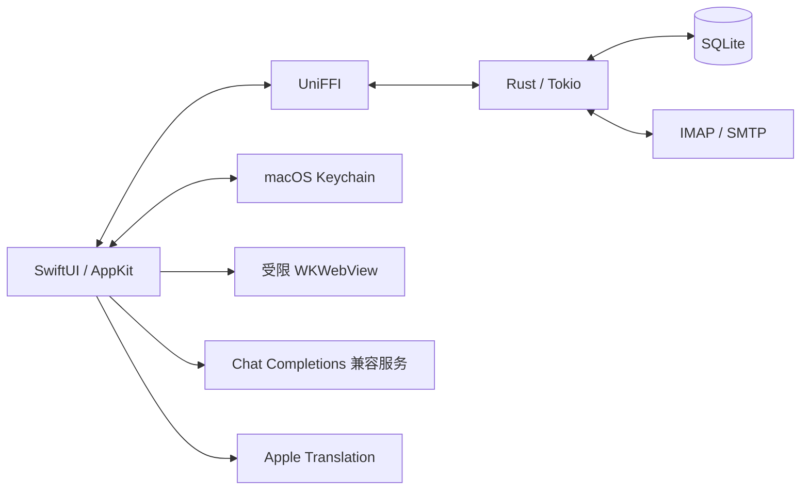

# 架构

轻邮使用原生 macOS 界面和本地邮件内核，运行时无需 Node、Python、Rust 工具链或独立后台服务。



## 分工

| 层 | 位置 | 职责 |
|---|---|---|
| 界面与状态 | `Sources/Lightmail/` | 账号、原生列表、阅读、草稿、翻译与 Keychain |
| 邮件内核 | `core/` | TLS 连接、IMAP、SMTP、MIME、SQLite、缓存及 HTML 清理 |
| 语言边界 | `Generated/FFI/` | UniFFI 生成的 Swift / C 接口 |
| 校验与构建 | `scripts/`、`tests/` | 本地协议服务器、渲染检查、内存回归、打包 |

## 收件与阅读

摘要先写入 SQLite，再显示到原生列表。首次每目录读取最新 50 封，「加载更多」补充历史摘要。收件箱通过 IMAP IDLE 接收变化提示，轮询补偿失败、断线和唤醒后的差异。

全文阅读、后台预加载与目录同步使用分离的连接通道，避免点开邮件时排队等待整箱同步。HTML 经清理后保留样式表、class 和表格几何；浏览器内容策略限制可执行内容与资源请求。Markdown 使用受限转换器，避免嵌套表格放大正文。

## 每账号 20 封正文

每个邮箱账号各预加载并持久保留最新 20 封正文，按日期排序，排除垃圾箱与垃圾邮件。Gmail 标签副本按 canonical ID 去重。

```text
新邮件到达 → 更新摘要 → 计算本账号最新 20 封
                         ├─ 预加载新进入的正文
                         └─ 回收掉出窗口的正文与译文
```

旧邮件摘要继续保留，打开时临时读取，不重新进入持久正文缓存。草稿、导入原文、用户另存的附件不参与此回收。512 MiB 正文总预算与 32 MiB 翻译预算提供额外上限；这些预算不是整个数据目录的大小上限。

## 发件与翻译

草稿保存在本机，发送前有 5 秒撤销窗口。SMTP 接受、拒绝与结果不确定分别记录；连接在提交后中断时不会自动重复发送。

LLM 翻译在用户发起后执行。正文分块带稳定 ID，长邮件分批携带相邻上下文。结束前检查段落覆盖、数字和保护片段、截断与流中断；结构校验不等于语义质量保证。译文缓存按账号、正文哈希、模型、语言及配置区分。

## 资源边界

单封正文 4 MiB，转换后 8 MiB，HTML 最多 64 层 / 50,000 节点；超限明确报错。单附件下载 30 MiB，发送附件合计 25 MiB，EML 导入 30 MiB。首版没有 CID 图片渲染、附件翻译和服务器全量全文搜索。

关闭窗口后进程可继续同步；`⌘Q` 完全退出后不收信，不安装常驻守护进程。
