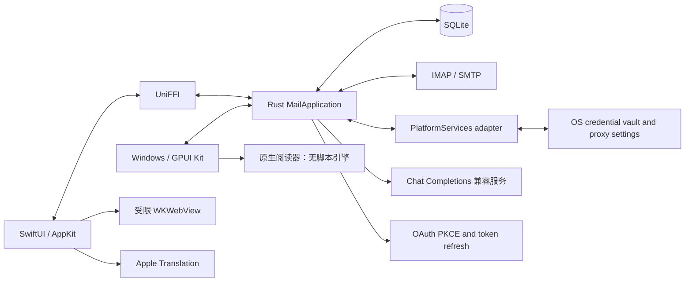

# 架构

轻邮使用原生 macOS / Windows 界面和本地邮件内核，运行时无需 Node、Python、Rust 工具链或独立后台服务。



## 分工

| 层 | 位置 | 职责 |
|---|---|---|
| 界面与交互 | `Sources/Lightmail/` | 选中项、窗口、列表渲染、阅读布局、系统语言包、粘贴板及文件选择 |
| Windows 界面 | `desktop/src/` | GPUI Kit 视图、编辑状态、原生阅读器、自绘窗口外框、凭据/代理适配 |
| 共享应用服务 | `core/application.rs` | 同步／IDLE／补偿轮询、任务生命周期、凭证刷新协调、预加载、延迟发送、翻译缓存与事件 |
| 共享业务模块 | `core/auth.rs`、`translation.rs`、`composition.rs` | OAuth PKCE／回调／刷新、LLM HTTP／SSE／校验、回复／转发、Markdown 导出 |
| 系统能力接口 | `core/platform.rs`、`Sources/Lightmail/CorePlatform.swift` | `PlatformServices` 提供凭证读写和代理解析；平台实现不决定同步或缓存策略 |
| 邮件内核 | `core/{store,transport,mime,cache,html}.rs` | TLS 连接、协议、MIME、SQLite、缓存淘汰及 HTML 清理 |
| 语言边界 | `Generated/FFI/` | UniFFI 生成的 Swift / C 接口 |
| 校验与构建 | `scripts/`、`tests/` | 本地协议服务器、渲染检查、内存回归、打包 |

## 原生客户端接入约定

`MailApplication` 是业务入口。Swift 通过 UniFFI 调用；Rust／GPUI 直接使用同一个 crate。记录类型、翻译配置和错误在 Rust 定义，Swift 不再复制业务模型。`MailStore` 只保存显示状态并把服务事件投递到主线程。

- 创建 `MailEngine`、平台适配器及 `ApplicationObserver`，再创建 `MailApplication`。调用 `start()` 开启监控，退出或切换数据库前调用 `stop()`；重复启动不会增加后台任务。
- `sync`、`body`、`mark`、`move_message`、`download`、`queue`、`submit`、`translate` 都是可等待的业务命令。前台阅读不等待后台整箱同步。FFI future 取消会中止对应 Rust 工作，后台账户任务由服务统一关闭。
- `ApplicationEvent` 发布数据变化、同步进度和发件结果；客户端负责更新显示，不根据界面是否可见决定缓存或发送状态。前后台切换只调用 `set_active`，30／120 秒轮询策略在 Rust。
- `PlatformServices` 凭证访问必须静默；macOS 的显式授权按钮与 Keychain 对话框留在适配层。系统凭证调用使用有上限的阻塞线程池，避免占住网络执行器。OAuth 浏览器由平台打开，其余授权流程在 Rust。
- Apple Translation 只负责语言包和系统翻译执行；分段、结果完整性验证和缓存仍复用 Rust。所有 LLM 网络请求、数字／链接保护、分批与失败判定共用一套实现。
- `MailEngine` 保留存储查询和旧协议测试入口；新客户端不要直接使用其阻塞式网络方法，也不要再添加自己的轮询、预加载、重试或发送计时器。

`examples/headless.rs` 展示不依赖 Swift、AppKit 或 GPUI 的消费端。CI 在 Windows、Linux 上运行共享核心单元测试和此示例；macOS 另运行真实 WebKit 与回环协议检查。Windows 专用 CI 构建 GPUI Kit 客户端，运行原生窗口与原生阅读器验收，并检查安装、启动、卸载后数据保留；使用隔离示例，仍不能替代真实设备与服务商验证。

## 收件与阅读

摘要先写入 SQLite，再显示到原生列表。首次每目录读取最新 50 封，「加载更多」补充历史摘要。收件箱通过 IMAP IDLE 接收变化提示，轮询补偿失败、断线和唤醒后的差异。

全文阅读、后台预加载与目录同步使用分离的连接通道，避免点开邮件时排队等待整箱同步。HTML 经清理后保留样式表、class 和表格几何；浏览器内容策略限制可执行内容与资源请求。Markdown 使用受限转换器，避免嵌套表格放大正文。

## 每账号 20 封正文

每个邮箱账号各预加载并持久保留最新 20 封正文，按日期排序，排除垃圾箱与垃圾邮件。Gmail 标签副本按 canonical ID 去重。

```text
新邮件到达 → 更新摘要 → 计算本账号最新 20 封
                         ├─ 预加载新进入的正文
                         └─ 回收掉出窗口的正文与译文
```

旧邮件摘要继续保留，打开时临时读取，不重新进入持久正文缓存。草稿、导入原文、用户另存的附件不参与此回收。512 MiB 正文总预算与 32 MiB 翻译预算提供额外上限；这些预算不是整个数据目录的大小上限。

## 发件与翻译

草稿保存在本机，发送前有 5 秒撤销窗口。SMTP 接受、拒绝与结果不确定分别记录；连接在提交后中断时不会自动重复发送。

计时器归 Rust 服务所有，撤销与提交通过 SQLite 状态比较互斥。取消正在提交的任务会立即保存 `delivery_unknown`；重启仍将未提交队列恢复为草稿，不自动补发。旧数据库、账户 ID 与 Keychain 键名保持兼容；共享翻译模板使用新的缓存版本，旧译文不会误当作新模板结果。

LLM 翻译在用户发起后执行。正文分块带稳定 ID，长邮件分批携带相邻上下文。结束前检查段落覆盖、数字和保护片段、截断与流中断；结构校验不等于语义质量保证。译文缓存按账号、正文哈希、模型、语言及配置区分。

## 资源边界

单封正文 4 MiB，转换后 8 MiB，HTML 最多 64 层 / 50,000 节点；超限明确报错。单附件下载 30 MiB，发送附件合计 25 MiB，EML 导入 30 MiB。首版没有 CID 图片渲染、附件翻译和服务器全量全文搜索。

macOS 关闭窗口后进程可继续同步；`⌘Q` 完全退出后不收信。不安装常驻守护进程。

## Windows 平台边界

Windows 客户端统一经 `gpui-kit =0.7.0` 使用 GPUI 与组件库。`desktop/src/app.rs` 把交互转换成共享命令；账号、文件夹、草稿和邮件列表在后台线程读取，只采用最新一次读取的结果。`events.rs` 合并唤醒，避免通知无限排队。`platform.rs` 访问 Credential Manager 和固定系统代理；超过单条凭据上限的值分片保存。单个邮箱的代理策略、验证、持久化和请求路由由 `core/account_proxy.rs` 管理，传输层连接时查询；Windows 表单提供系统、直连、HTTP、SOCKS5 选择。`oauth_browser.rs` 仅负责按该邮箱配置启动和清理独立授权浏览器，本机回调直连，详见 [账号代理](windows-account-proxy.md)。

`tray.rs` 管理 Windows 托盘、窗口图标、恢复已有实例与退出生命周期。关闭窗口隐藏到托盘；退出时保存草稿并停止服务。托盘立即收信调用 `MailApplication::refresh`；自动收信开关调用 Rust-only 的 `set_automatic_receiving`，只停后台监控/预加载，不取消手动命令和发送队列。Windows 偏好存于 `windows-automatic-receiving`，Mac 调用与默认行为不变。

原文默认使用 Blitz HTML/CSS，没有 HTML 时回退 Markdown。DOM、布局与图片下载在后台工作；GPUI 接收有界视口图像、链接命中和可访问文本元数据，负责滚动、选择与复制。没有引入 Blitz shell、Winit 或 WebView；完整浏览器 CSS 兼容性仍不作保证。早期 Kit TextView HTML 调研保留在 [阅读器记录](windows-html-reader.md)。

阅读器使用 Blitz 绘制原文 HTML/CSS 的有界视口区域，Kit TextView 承载 Markdown、译文及双语文本；没有脚本引擎。图片默认禁止请求，用户对当前邮件允许后，通过核心与该邮箱的代理范围下载，保持同源重定向及数量、压缩缓存、解码像素预算；切换邮件或保存账号淘汰旧请求与结果。详见 [原生阅读器](windows-blitz-viewport-accessibility.md)。正文 http、https 和 mailto 链接经二次确认后交给系统应用，支持复制完整网址，见 [链接确认](windows-mail-link-confirmation.md)。两端正文、安全策略与导出调用共享 `presentation.rs` / `composition.rs`。

窗口没有系统标题栏。`window_chrome.rs` 自绘最小化、最大化和关闭；按钮区域向 Windows 返回原生命中测试结果，保留贴靠布局和系统菜单。侧栏 Logo、列表标题、阅读工具栏空白处，以及设置和写信弹窗外的遮罩可拖动窗口。

同一个数据目录只允许一个进程打开：启动时取得操作系统文件锁，第二个进程提示后退出。关闭 Windows 窗口会停止服务并退出。安装器安装到用户目录；卸载保留邮件与草稿，移除账号在应用内确认。

CI 检查阅读器渲染出的正文文字和屏幕实际像素、默认图片与链接策略、窗口按钮与拖动区的命中测试、最大化与还原，以及安装、启动、卸载后数据保留。
