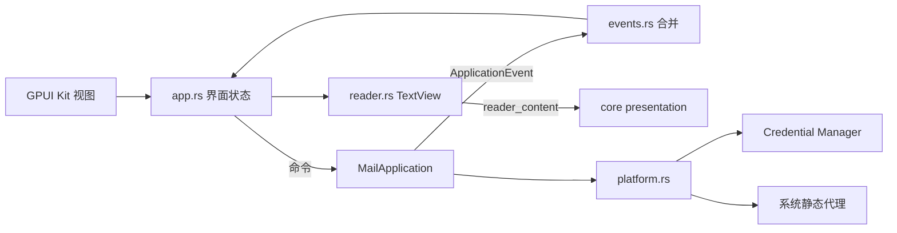

# Windows 客户端迭代计划：gpui-kit 与原生阅读

| 项 | 内容 |
| --- | --- |
| 基线 | 上游 `baileyh8/lightmail` `5ab113a`（v0.0.4 标签之后，已合并 PR #1 共享服务和 PR #2 钥匙串授权修复） |
| 分支 | `feat/windows-gpui-kit`（本地分支，不推送） |
| 日期 | 2026-09-29 |
| 前序工作 | fork 上旧的 `wip/windows-support` 已删除，其代码不迁移 |

## 1. 目标与约束

在上游共享服务 `MailApplication` 之上继续完善 Windows 客户端 `desktop/`，技术路线调整为：

- **界面**：统一经 `gpui-kit =0.7.0` 使用 GPUI（`gpui-pre 0.3.7`）和组件库（`gpui-component 0.7.0`），不再直接依赖 `gpui 0.2.2`、`gpui-component 0.5.1`。
- **不使用 WebView**：移除 `wry`、WebView2 宿主和 vendored 的 `third_party/gpui`。那份补丁只是为了让 WebView2 子窗口显示在 GPUI 绘制层之上，去掉 WebView 后就不需要了。
- **阅读器**：用 Kit 的 `TextView` 原生渲染 Markdown 和受限 HTML。默认不发出任何远程资源请求；链接只允许 http、https、mailto，并交给系统打开。
- **凭证**：沿用上游的 Windows Credential Manager（`keyring`）。超过单条凭据上限的值自动分片保存。

边界约定：

- 业务规则只写在 Rust 核心。GPUI 层只负责选择、布局、对话框和系统交互，与 `AGENTS.md` 的约定一致。Windows 需要的新能力加到 `core/`，先以 Rust 公开接口提供，不加 `#[uniffi::export]`，这样不会让已提交的 Swift 绑定过期。
- 不改 Mac 专属文件：`Sources/Lightmail/`、`Generated/`、`Resources/Info.plist`、`Resources/AppIcon.icns`、`Package.swift`。Windows 图标由现有 artwork 转出，另存 `Resources/AppIcon.ico`。核心里的行为修复会同时作用于 Mac，但导出接口的签名保持不变，每项修复都会在提交说明里写明对 Mac 的影响。
- 需要改导出接口、重新生成 Swift 绑定的事项（例如类型化错误），放到 I6，作为给上游的提议。

## 2. 问题清单与归属

来源说明：「H」是之前 handoff 对照后仍未解决的问题，「R」是本次 review v0.0.4 新发现的问题，「N」是本计划补充的问题。

| # | 来源 | 问题 | 处理方式 | 迭代 |
| --- | --- | --- | --- | --- |
| 1 | R-1 / H-7.9 | Windows 没有单实例保护，第二个进程启动时的崩溃恢复会打乱第一个进程的发件状态 | 打开数据库前获取数据目录的操作系统独占锁，拿不到就提示并退出 | I2 |
| 2 | R-2 / H-分叉7 | 删除账号不检查待发邮件，会中断正在提交的邮件并删掉 `delivery_unknown` 记录 | 核心拒绝删除存在 queued/sending 邮件的账号；先删数据库记录，再清理凭证 | I1 |
| 3 | R-3 / H-分叉6 | "加载更早"的补拉编排在 Swift 和 GPUI 各写一份，星标视图永远补拉不到 | 核心新增 `MailApplication::load_older`，由核心选择目标文件夹；Windows 改用它，Mac 等上游采用 | I1、I3 |
| 4 | R-4 | 密码框残留的值会覆盖 OAuth 令牌，Mac 的 `SettingsView` 也有同样的问题 | 核心对 OAuth 账号忽略密码参数；Windows 表单切换认证方式时清空密码框 | I1、I3 |
| 5 | R-5 | `save_account` 先写凭证，数据库保存失败时不回滚 | 失败时恢复原凭证；新增密码账号必须提供密码 | I1 |
| 6 | R-6 | OAuth 刷新写回令牌时可能覆盖刚完成的重新授权 | 写回前比较存储值，发现已被更新就不覆盖 | I1 |
| 7 | H-7.5 | 草稿状态仍是字符串，两端界面各写一遍"能否编辑、撤销、重试、删除" | 核心新增 `DraftState` 判定，Windows 界面只调用它 | I1、I3 |
| 8 | N | `delivery_unknown` 的邮件两端都没有处理入口，会一直留在待发送列表 | 核心新增 `resolve_delivery`：确认已送达，或退回草稿；Windows 提供按钮 | I1、I3 |
| 9 | H-分叉3 | 新账号颜色两端不一致，Windows 编辑账号时还会覆盖原来的颜色 | 核心新增 `provider_color`；Windows 编辑时保留原色 | I1、I3 |
| 10 | R-8 | Credential Manager 单条凭据最多 2560 字节（UTF-16），将来 JWT 类令牌会超限 | 平台层对超长值自动分片，读取时合并 | I2 |
| 11 | R-9 | Windows UI 线程上同步读写 SQLite：每次事件跑 4 个查询，写信时每按一次键写一次库 | 列表查询移到后台执行；草稿自动保存加去抖 | I3 |
| 12 | R-10 | WebView2 与 GPUI 的空域问题：GPUI 画的弹出层会被阅读器挡住 | 移除 WebView，问题随之消失 | I3 |
| 13 | R-11 | CI 用浮动的 stable 工具链；vendored GPUI 连 examples 一起放进仓库，多了约 10 万行 | CI 固定 Rust 与 Inno Setup 版本，构建脚本检查最低版本；删除 `third_party/gpui` | I3、I4 |
| 14 | 技术路线 | 阅读器依赖 WebView2；验收脚本检查 WebView DOM 和像素 | 原生阅读器；验收改为检查原生阅读器的渲染、图片策略和链接策略 | I3、I4 |
| 15 | R-7 | `Problem` 事件同时承载成功状态 | 需要改导出的枚举 | I6 |
| 16 | H-7.6 | 错误只有 `Failure { message }` 一个变体 | 需要改导出的错误类型和 Swift 代码 | I6 |
| 17 | H-7.10 | 代理路由只在获取凭证时刷新，并写进引擎的全局状态 | 观察项，提议由连接时查询 | I6 |
| 18 | H-7.8 | 同步结束时重复清理正文缓存 | 低优先级清理 | I6 |
| 19 | 未验证 | 中文输入法、Narrator、DPI 与多屏、真实服务商收发、长时间运行 | 人工验收并记录 | I5 |
| 20 | N | 上游 Windows 窗口用系统标题栏，没有我们旧分支的无边框自绘窗口 | 隐藏系统标题栏和 Windows 11 描边，右上角自绘三个窗口按钮；指定区域可拖动窗口 | I3 |

## 3. 目标结构

```text
core/
  application.rs    MailApplication；新增 load_older、resolve_delivery（Rust 公开接口）
  presentation.rs   新增 DraftState、provider_color、reader_content（原生阅读用）
desktop/
  Cargo.toml        gpui-kit =0.7.0（component、assets），keyring，winreg，rfd
  src/main.rs       启动：单实例锁 → 打开引擎 → Kit 初始化 → 窗口
  src/instance.rs   数据目录独占锁
  src/platform.rs   PlatformServices：Credential Manager（含分片）、系统静态代理
  src/events.rs     核心事件合并（沿用）
  src/app.rs        界面状态与命令；数据库查询在后台执行
  src/views.rs      Kit 组件布局
  src/reader.rs     原生阅读器：TextView、图片策略、链接策略
  src/images.rs     用户允许后才加载的远程图片，经核心下载，有大小上限
  src/window_chrome.rs 无边框窗口：自绘窗口按钮、Win32 命中测试
  src/acceptance.rs 原生验收（acceptance feature）
third_party/gpui    删除
```



## 4. 迭代

### I0 分支与清理（已完成）

- 删除旧的 `wip/windows-support` 分支和 `apps/windows` 构建产物。
- 从上游 `f491add` 创建 `feat/windows-gpui-kit` 并提交本计划；随后变基到上游 `5ab113a`。PR #2 只改了 Mac 钥匙串授权和 Windows 验收脚本的内存采样，不影响本计划。

### I1 共享核心修复（已完成）

范围：问题 2、3、4、5、6、7、8、9 的核心部分，以及原生阅读需要的 `reader_content`。

- `remove_account`：持有账号凭证锁时检查 queued/sending 邮件，存在就拒绝。持锁期间发件任务过不了取凭证这一步，所以检查不会被并发的发送绕过。
- `save_account`：OAuth 账号忽略密码参数；新增的密码账号必须提供密码；数据库保存失败时恢复原凭证。
- OAuth 刷新：写回前重新读取存储值，只有未被他人更新时才写入。
- `load_older(account_id, folder_id, scope)`：由核心选择目标文件夹。星标视图使用 All Mail（Gmail）或"除垃圾箱和垃圾邮件以外的所有远程文件夹"；跳过本地导入、示例账号和停用账号。
- `DraftState`：`editable`、`withdrawable`、`retryable`、`deletable`、`in_outbox`，规则与 `delete_draft`、`submit`、`cancel_queued` 的实际限制一致。
- `resolve_delivery(id, delivered)`：只对 `delivery_unknown` 生效。确认送达时记为 `accepted`，否则退回草稿，并在 `last_error` 里记录用户的确认。
- `provider_color`：与 Mac 现有配色一致。
- `reader_content`：按原文、译文、双语返回原生阅读需要的内容，复用译文校验和 Markdown 结构预算。

验收：`cargo test --locked --lib` 全部通过，每项修复都有回归测试；`python scripts/check.py --protocols-only` 通过；导出接口签名不变；Swift 文件无改动。

### I2 Windows 平台层（已完成）

范围：问题 1、10，以及工具链固定。

- `instance.rs`：打开数据库之前，对 `<数据目录>/.lightmail-instance.lock` 加操作系统独占锁，进程退出时自动释放。拿不到锁就弹出提示并退出。示例模式和真实邮箱使用不同目录，互不影响。
- `platform.rs`：值的 UTF-16 编码超过 2560 字节时，分片保存为 `key#<代次>.<序号>`，主条目只存分片清单；读取时合并，缺片时报错而不是返回截断的值。覆盖时先写新代次的分片，再写清单，最后删除旧分片，所以写入中途失败时旧值仍然可读。分片逻辑与后端分离，可以在任何平台上单元测试。
- 工具链：CI 固定 Rust 1.97.0；本地构建脚本只检查不低于 1.97，不强制下载指定版本（见 I4）。

验收：锁的单元测试，以及"第二个进程拿不到锁"的测试；分片的往返测试和边界测试；`cargo test -p lightmail-desktop` 通过。

### I3 界面迁移到 gpui-kit，原生阅读器（已完成）

范围：问题 3、4、7、8、9、11、12、13、14 的界面部分，以及问题 20。

- 依赖：`desktop/Cargo.toml` 改为 `gpui-kit =0.7.0`；删除 `gpui`、`gpui-component`、`wry`、`raw-window-handle`；删除根 manifest 里的 `gpui` patch 和 `third_party/gpui`；更新锁文件，确认核心依赖版本不变。
- 移植：`main.rs`、`views.rs`、`app.rs`、`shortcuts.rs`、`assets.rs` 按 gpui-pre 0.3.7 和 gpui-component 0.7.0 的 API 调整；应用自带图标优先，其次使用 Kit 自带图标。
- 原生阅读器 `reader.rs`：
  - 原文默认用 Markdown 渲染，可切换受限 HTML；译文和双语走 `reader_content`。
  - `image_source` 接管所有图片。默认返回占位图，不发请求；用户点"显示图片"后只对当前邮件放行 http、https 和 data 图片，切换邮件后重置。
  - `on_link_click` 只放行 http、https、mailto，交给系统打开；其他协议忽略。
  - 文本可选择、可复制；长正文使用 TextView 自带的滚动。
- 界面修复：
  - 列表、草稿、文件夹查询放到后台执行，按选择代次丢弃过期结果。已完成：
    - 账号、文件夹、草稿、邮件列表，以及选中邮件的缓存正文，一次读取、在后台执行。
    - 新的读取会替换未完成的旧读取。用户已离开的视图或页码，其结果不会落地；为上一次选择读到的正文也会被丢弃。
    - 首次读取在窗口显示前同步完成，已有账号时不会闪出欢迎页。
    - 存储统计和清理正文缓存（含 `VACUUM`）也移到后台；"加载更早"检查本地下一页时同样不占界面线程。
    - `app.rs` 里的 GPUI 无窗口测试覆盖以上三点。视图切换的测试跑 16 个调度种子，去掉保护后必然失败。
  - 草稿自动保存加去抖（约 800ms）。
  - 账号表单切换认证方式时清空密码框；编辑账号时保留原颜色，新账号用 `provider_color`。
  - 待发送列表的按钮完全由 `DraftState` 决定；"结果待确认"的邮件提供"已在服务端确认送达"和"退回草稿"两个操作。
  - "加载更早"改为调用 `load_older`。
- 无边框窗口 `window_chrome.rs`（从旧分支移植）：
  - 隐藏系统标题栏和 Windows 11 的 1px 描边，保留阴影和缩放边框。
  - 右上角绘制最小化、最大化/还原、关闭。鼠标走 Win32 原生命中测试，保留 Windows 11 的贴靠布局；键盘和 UI Automation 走按钮的点击。最大化按钮自己切换还原，因为 GPUI 的 zoom 只会最大化。关闭发送 `WM_CLOSE`，与 Alt+F4 走同一条路径。
  - 可拖动区域：侧栏 Logo 行、列表标题、阅读栏工具条的空白处、无账号时欢迎页顶部，以及设置和写信弹窗外的遮罩边距。拖动区里不放其他控件；窗口按钮和浮在遮罩上的提示条会挡住下面的拖动区。
  - 验收：对按钮和拖动区发送 `WM_NCHITTEST`，核对 Win32 返回码；点击最大化后再点击还原；弹窗打开时核对遮罩边距可拖动，弹窗内的控件仍可点击。

验收：`cargo build --release -p lightmail-desktop` 通过；`cargo test -p lightmail-desktop` 通过；`cargo tree -p lightmail-desktop` 里没有 `wry`、`webview2-com`、`gpui 0.2.2`、`gpui-component 0.5.1`；`--demo` 模式能打开窗口，完成浏览、阅读、写信、设置的基本操作。

### I4 验收脚本、CI 与文档（已完成）

- `acceptance.rs`：去掉 WebView DOM 检查，改为检查阅读器渲染出了正文、默认图片请求数为零、链接协议被正确过滤、60 次阅读复用没有失控增长；保留剪贴板、设置、草稿持久化和凭据往返检查。
- `scripts/check-windows.ps1`：阅读区像素检查改为针对原生阅读器；去掉 WebView2 进程树内存统计，只统计应用进程。
- CI `windows-desktop`：固定工具链；如果 Kit 的 runtime shaders 不需要 fxc，就去掉这一前置要求。
- 打包：安装说明去掉 WebView2 Runtime 要求。
- 文档：`docs/architecture.md` 的 Windows 部分、`README.md` 的 Windows 要求、`AGENTS.md` 里关于 WebView2 的描述；重新生成 `THIRD_PARTY_NOTICES.md`。

验收：本机依次跑完 `build-windows.ps1`、`package-windows.ps1`、`check-windows.ps1`。安装验收会在隔离目录里静默安装并卸载，运行前先征得同意。

完成情况（2026-09-30）：

- 本机按 CI 的顺序跑完了构建、release 测试、打包、原生验收和隔离安装/卸载验收，全部通过。安装前确认过本机没有已安装的轻邮，所以验收不会覆盖已有安装；卸载后注册表和开始菜单没有残留。
- 和原计划不同的地方：
  - 本地 `build-windows.ps1` 只检查 Rust 不低于 1.97，不强制下载指定版本；固定版本只放在 CI（Rust 1.97.0，Inno Setup 6.7.1，后者是 Chocolatey 上 6.7 系列的最新版）。
  - fxc 仍然需要：gpui-pre-windows 在构建时编译着色器，会从 `GPUI_FXC_PATH`、PATH 和 Windows SDK 注册表里找 fxc。
  - `check-windows.ps1` 的截图改用 PrintWindow，只截本窗口，不会把压在上面的其他窗口截进去。屏幕截图原本是为了发现 WebView2 被 GPUI 绘图层遮挡，没有子窗口后不再需要。
  - `check-windows.ps1` 每个阶段开始前清空本阶段的数据和报告目录；否则上一次运行留下的报告会让等待和采样提前完成。
- 新增 `-SoakReads N`：按顺序打开列表里完整可见的示例邮件 N 次，记录每次阅读后的工作集和私有内存，最后静置 30 秒；私有内存净增超过 64 MiB 判失败。它属于 I5 的长时间运行项。

### I5 人工验收与真实环境（自动部分已完成，其余待人工）

- 中文输入法：微软拼音和至少一种第三方输入法；组合串、候选框位置、中英混输、撤销与重做。
- Narrator：账号、邮件行、按钮、输入框的角色、名称和状态能被正确读出。
- DPI：100%、150%、200%，以及多屏间拖动窗口。
- 无边框窗口：悬停最大化按钮时出现贴靠布局；双击拖动区可最大化和还原；右键拖动区弹出系统菜单；Tab 到窗口按钮后按回车可用，Narrator 能读出按钮名称。
- 真实服务商：QQ、163 授权码账号和 Gmail OAuth 的收信；发信需要你明确授权后才做。
- 长时间运行：静置和连续阅读 500 封的内存曲线。

结果记录在 `docs/validation/`（该目录已被 `.gitignore` 忽略，不会提交）。

完成情况（2026-09-30）：

- 长时间运行：用 `check-windows.ps1 -SoakReads 1500` 连续阅读 1500 封示例邮件后静置 30 秒。私有内存呈锯齿形，第 300 次到第 1500 次净增 6.6 MiB，工作集峰值 105.7 MiB，没有持续增长。只用了示例数据，不代表真实大邮箱。
- 无边框窗口的命中测试和最大化/还原已自动验证；贴靠布局、双击、右键系统菜单、键盘和 Narrator 仍需人工。
- 输入法、Narrator、150%/200% DPI 与多屏、真实服务商收发需要人手或真实账号，尚未进行。本机只验证了 100% 缩放。

### I6 与上游协同（提议已整理）

以下事项需要改导出接口或 Swift 代码，本分支不做，整理成提给上游的提议：

- 类型化错误（至少区分已取消、忙、需要重新授权、网络、服务器、输入无效）。
- 事件类型拆分：把成功状态从 `Problem` 里分离出来。
- 把 `load_older`、`DraftState`、`resolve_delivery`、`provider_color` 导出给 Swift，并删除 Mac 端的 `loadOlder` 编排。
- 代理路由改为连接时查询。
- 清理重复的正文缓存清理。
- 内核级单实例保护（需要先处理 Mac 切换示例库时新旧引擎短暂并存的情况）。

以上各项，连同本分支已对 Mac 生效的核心行为变化和发版时要一起更新的文档，已整理在 [windows-upstream-proposals.md](windows-upstream-proposals.md)。

### I7 真实测试反馈：图标、托盘与 HTML（2026-09-30）

- Windows 图标：从现有 `AppIcon.icns` 生成多尺寸 `AppIcon.ico`，嵌入 EXE，配置安装程序与快捷方式；运行时设置大小窗口图标。
- 托盘：原生 Shell 图标和右键菜单「打开轻邮 / 立即收信 / 自动收信 / 退出轻邮」。关闭或 Alt+F4 隐藏窗口，服务继续运行；再次启动同一数据目录恢复原窗口；处理 Explorer 重建与退出清理。
- 收信开关：共享 Rust 新增仅控制后台监控/预加载的接口；不调用整体 `stop()`，不影响待发邮件与手动命令。偏好仅供 Windows 使用。
- 验收补上 EXE 资源、大小窗口图标、Shell 注册、隐藏/恢复、立即收信、偏好持久化和模拟 Explorer 重建。`check-windows.ps1` 支持 `-SkipInstaller`，已有安装时拒绝安装验收。
- HTML：默认改走已有 HTML 分支，无 HTML 回退 Markdown。**复杂布局仍未修复**；不再把 Kit TextView 称为原始排版，详见 [核对结果与下一轮验证计划](windows-html-reader.md)。独立 litehtml 阅读器是建议验证的方向，本轮尚未接入。

## 5. 风险

| 风险 | 应对 |
| --- | --- |
| gpui 0.2.2 到 gpui-pre 0.3.7 的 API 差异 | 逐文件移植；每次提交都保证能编译、测试能通过 |
| Kit 的 HTML 渲染缺少复杂邮件布局能力 | 当前默认简化 HTML，可切换 Markdown；已明确不保证原样显示，下一轮按 HTML 阅读器文档验证独立排版引擎 |
| GPUI 图片加载没有字节上限的钩子 | 远程图片只在用户逐封允许后加载；以后可以换成自建的带上限下载器 |
| Kit 可能需要比默认 stable 更新的 Rust | 构建脚本和 CI 固定到验证过的版本 |
| 上游继续修改 `desktop/` | 定期 rebase；核心修复单独提交，方便拆成上游 PR |
| 核心修复改变 Mac 的行为（例如删除账号会被拒绝） | 在提交说明和 PR 描述里写清楚 |

## 6. 约定

- 每个迭代拆成若干提交，使用 `fix:`、`feat:`、`docs:` 前缀。提交前运行 `cargo fmt`、`cargo test --locked --lib`；改到 Windows 的还要运行 `cargo test -p lightmail-desktop`；改到协议或发件的运行 `python scripts/check.py --protocols-only`。
- 不推送到任何远端。
- 不提交真实凭证、真实邮件或账号数据库；测试只用虚构数据。
